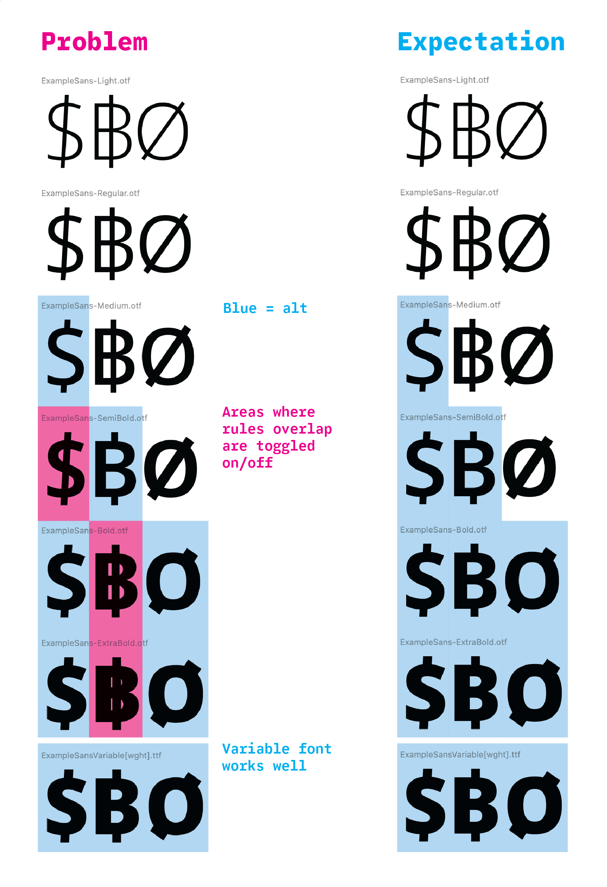

# FontMake issue

A reproduction case for a FontMake (and partly glyphsLib?) issue.

Font outlines based on Open Sans (https://github.com/googlefonts/opensans).

## Problem

It is common to up “bracket layers” in Glyphs, in order to create alternate glyphs shapes for certain areas of a typeface’s designspace. For example, it is common to remove the middle bar of a `$` for bolder weights.

Currently, generating from a Glyphs document to static fonts has unexpected results, where certain fonts will have the wrong version of a glyph. This is partially caused by two issues:

1. glyphsLib creates more rules than strictly necessary: it creates one rule for each area mentioned in any bracket layer, then places all glyphs with alternates in that area into each rule. This is slightly redundant, but shouldn’t cause a failure in the build. 
2. FontMake inteprets redudant rules in a way that toggles them off and on, in static font builds. Variable font builds work well.



The above issues come from a `rules` element like this:

```xml
<rules>
    <rule name="BRACKET.Weight_650_800">
        <conditionset>
            <condition name="Weight" minimum="650" maximum="800"/>
        </conditionset>
        <sub name="Oslash" with="Oslash.BRACKET.varAlt01"/>
        <sub name="baht" with="baht.BRACKET.varAlt01"/>
        <sub name="dollar" with="dollar.BRACKET.varAlt01"/>
    </rule>
    <rule name="BRACKET.Weight_550_800">
        <conditionset>
            <condition name="Weight" minimum="550" maximum="800"/>
        </conditionset>
        <sub name="baht" with="baht.BRACKET.varAlt01"/>
        <sub name="dollar" with="dollar.BRACKET.varAlt01"/>
    </rule>
    <rule name="BRACKET.Weight_450_800">
        <conditionset>
            <condition name="Weight" minimum="450" maximum="800"/>
        </conditionset>
        <sub name="dollar" with="dollar.BRACKET.varAlt01"/>
    </rule>
</rules>
```

The “working” example comes from a `rules` element like this (with redundant rules removed):

```xml
<rules>
    <rule name="BRACKET.Weight_650_800">
        <conditionset>
        <condition name="Weight" minimum="650" maximum="800"/>
        </conditionset>
        <sub name="Oslash" with="Oslash.BRACKET.varAlt01"/>
        <!-- baht rule removed -->
        <!-- dollar rule removed -->
    </rule>
    <rule name="BRACKET.Weight_550_800">
        <conditionset>
        <condition name="Weight" minimum="550" maximum="800"/>
        </conditionset>
        <sub name="baht" with="baht.BRACKET.varAlt01"/>
        <!-- dollar rule removed -->
    </rule>
    <rule name="BRACKET.Weight_450_800">
        <conditionset>
        <condition name="Weight" minimum="450" maximum="800"/>
        </conditionset>
        <sub name="dollar" with="dollar.BRACKET.varAlt01"/>
    </rule>
</rules>
```


## Reproduction

First, generate a UFO+designspace:

```
glyphs2ufo '01-src/ExampleSans.glyphs' --output-dir '02-glyphs2ufo'
```

Then, build fonts:

```
fontmake -o variable -m '02-glyphs2ufo/ExampleSans.designspace' --output-dir '03-fonts'
fontmake -o otf -i -m '02-glyphs2ufo/ExampleSans.designspace' --output-dir '03-fonts'
```

Finally, open fonts in Font Goggles (or similar) and preview glyphs `$฿Ø`.

## The fix, sort of

If the redundant rules are removed, the static fonts generate with the expected substitutions.

However, this shouldn’t be necessary to generate fonts with expected glyph forms, so it would be much better for this issue to be fixed in FontMake (or in the appropriate library repsponsible for interpolating static fonts from a designspace – maybe ufo2ft?)
